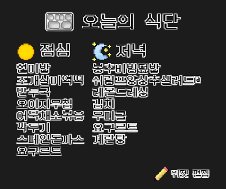

title: 바탕화면 급식표 위젯 프로그램

# 🌆️ 테마 변경 방지 프로그램

 
 
프로그램 최신버전 1.2.1 
[다운로드 ⬇️](https://github.com/qwreey75/schoolMealsWidget/releases/latest/download/School-Meals.Setup.exe "이 링크를 누르면 가장 최신 버전의 설치파일이 받아집니다"){ .md-button }
 
*서버 상태상 다운로드가* 
*느리더러도 양해 부탁드립니다*

## 🏁️ 이 프로그램의 목적

학교에서, 학생들이 학교 컴퓨터로 궁굼한 오늘의 급식을 검색해보는 경우가 종종 있습니다. 그런데 이것은 시간이 오래 걸리고, 불편하며 모두가 볼 수 있는것이 아니였습니다
 
그래서 배경화면에 그냥 바로 급식 정보를 표시해버리면 TV 나 전자칠판에서 바로 볼 수 있기 때문에, 직접 검색하기 위해 타이핑 하고 있을 필요도 없고, 모두가 볼 수 있게 만들 수 있다고 생각해서 만들게 되었습니다

## ⬇️ 설치&사용 방법

단순히 이 프로그램을 설치하고, 실행하면 바탕화면에 생긴 위젯에서 '위젯 편집' 버튼을 찾을 수 있습니다  
그 버튼을 누른다음, 학교 검색에서 자신의 학교를 검색하고 선택한 뒤 저장하고 사용하시면 됩니다  
