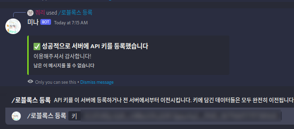

title: 시작하기 (API 등록법 / 설정법)

**[표지로 가기](/mina/rblxConnect)**

# 시작하기

## API 등록하기
미나와 로블록스의 연결을 사용하려면 먼저 API 키를 발급받아야 합니다.
*API 키는 개당으로 유료로 판매되며 상품 구매시 발급받을 수 있습니다*<br>
<br>
API 키를 발급받으셨다면. 원하는 서버에 API 키를 등록해주셔야 합니다.
*등록하는 서버는 언제든지 API 키만 있다면 다른 곳으로 데이터 손실 없이 변경할 수 있습니다*<br>
다음과 같이 `/로블록스 등록` 을 이용해 키를 정상적으로 등록시켜 주세요.
*단 그 서버의 주인만 이용가능한 명령어입니다*<br>
<div align=center markdown></div>

이렇게 하면 등록이 완료됩니다!

## 편집 룰 지정
화이트리스트 추가/제거, 블랙리스트 추가/제거를 할 수 있는 특정한 룰을 지정해줄 수도 있습니다. 다음의 명령어를 이용해보세요<br>
`/로블록스 권한`<br>
<div align=center markdown></div>

*룰 부분을 비워두면 지금의 룰을 확인할 수 있습니다*<br>
이렇게 룰을 설정하고 해당 룰을 필요한 유저에게 넣어주면 해당 유저가 화이트리스트와 블랙리스트 등을 조작할 수 있게 됩니다.

## API 등록 취소하기
서버에서 API 키를 등록 취소하고 싶으면 `/로블록스 해지`를 이용하세요.
단 API 키가 사라지지는 않으며 데이터도 모두 유지됩니다. 다른 서버에서
키를 이용하거나 잠시 기능을 끄고싶을 때 유용합니다

<div align=center markdown></div>

## 서버 스크립트 생성하기
다음 코드를 ServerScriptService 안에 넣으세요. 그 후 APIKEY 부분을 자신의 API 키로 변경해주세요. 예외 처리나 메시지 글자 변경과 같은 작업은 코드 상단의 설정 부분에서 변경할 수 있습니다<br>
??? 코드
    ```lua
    --                                        CONFIG
    ------------------------------------------------------------------------------------------
    -- 발급받은 API 키입니다
    -- 디스코드에서 /로블록스 등록 키
    -- 명령을 통해 필요한 서버에 등록하여 같이 연결해 사용하세요
    -- 또한 화이트리스트 추가 블랙리스트 추가가 가능한 역할을 지정하려면
    -- /로블록스 권한 역할멘션
    -- 을 통해 특정 역할에게 허용여부 편집권한을 줄 수 있습니다
    -- 이 키는 다른이에게 노출되어서는 안됩니다
    -- 예시 값은 다음과 같습니다
    -- local APIKEY = "34P5aoWM1KeZ79On4hovSKTD97Z.OaTl9gwL"
    local APIKEY = "여기에API키입력"

    -- 예외 유저 함수입니다
    -- 특정 그룹을 허용하거나 특정 인물을 허용하는 등 예외적인
    -- 상황이 필요할 때 이 코드를 이용하세요
    -- 반환 값이 true  이면 킥 (문자열인 경우 화면에 표시)
    -- 반환 값이 false 이면 유지
    -- 반환 값이 nil   이면 화이트리스트나 블랙리스트에 의해 처리됩니다
    -- 이 함수에 오류가 발생하면 자동으로 nil 로 반환한것으로 처리합니다
    -- 그러나 오류 정보는 여전히 출력됩니다
    local function expection(user)
        -- user 는 Player 입니다

        -- 예시 : 123456 이라는 아이디를 가진 그룹에 있는 경우 허락
        -- if user:IsInGroup(123456) then
        -- 	return false
        -- end

        -- 예시 : 789012 이라는 아이디를 가진 그룹에 있는 경우 킥 & 킥 메시지 보여주기
        -- if user:IsInGroup(123456) then
        -- 	return "블랙리스트된 그룹에 있습니다"
        -- end

        -- 예시 : 계정 생성일이 30 일 전 이하인 경우 킥
        -- if user.AccountAge < 30 then
        -- 	return true
        -- end

        -- 이외의 경우 화이트리스트/블랙리스트에 의해 처리
        return nil
    end

    -- 요청 URL 입니다
    -- 일반적인 상황에서 이것을 바꿀 필요는 전혀 없습니다
    local baseURL = "http://possible-maintain.at.playit.gg:14208/"

    -- 화이트리스트 모드에서 화이트리스트 되지 않은 유저에게 보이는 메시지입니다
    -- 이 값은 너무 길면 짤립니다. 또한 이 값이 길면
    -- 설정한 도움 링크도 깨지므로 길이에 유의해주세요
    -- (로블록스 Kick 메시지 길이 제한에 의한것입니다)
    local notWhitelisted = "당신은 화이트리스트 되지 않았습니다"

    -- 화이트리스트 모드에서 화이트리스트 되지 않은 유저에게 보이는 메시지입니다
    -- 이 값은 너무 길면 짤립니다. 또한 이 값이 길면
    -- 설정한 도움 링크도 깨지므로 길이에 유의해주세요
    -- (로블록스 Kick 메시지 길이 제한에 의한것입니다)
    local blacklisted = "당신은 블랙리스트 되었습니다"

    -- 이외의 결과로 인해 허용되지 않은 경우입니다
    -- 예를 들면 expection() 예외 유저 함수에서 문자열 값이 아닌 true
    -- 를 반환한 경우 이 메시지를 보여줍니다
    local notAllowed = "당신은 허용되지 않았습니다"

    -- 블랙리스트/화이트리스트 시스템 오류가 발생할 때 유저를 킥할 여부입니다
    -- expection() 예외 유저 함수의 성공 여부와는 관련이 없으며
    -- 서버의 응답이 잘못된 경우, 코드 전체의 오류가 발생한 경우에
    -- 작동합니다
    local kickWhenErrorOccurred = true;

    -- API 키가 올바른지 사전 확인합니다
    -- 또한 HTTP 서비스가 올바르게 활성화 되었는지도 확인합니다
    -- 이 값을 false 로 바꾸면 오류가 발생할 수 있습니다
    -- 필요한 경우 이 값을 바꾸지 마세요. 오류 판단이 어려워집니다
    -- (이 값이 false 이여도 API 키 없이 사용 가능한것은 아닙니다)
    local checkAPIKEY = true;
    ------------------------------------------------------------------------------------------
    --
    --     이 스크립트는 ServerScriptService 에 두어야 합니다. 혹시 다른곳에 두지는 않았나요?
    --
    ------------------------------------------------------------------------------------------
    --
    --  이 코드는 저작권법에 의해 보호됩니다. 당사자의 허락 없이 배포를 금합니다 qwreey75@gmail.com
    --

    local http = game:GetService"HttpService"
    local players = game:GetService"Players"

    local function request(method,uri,body)
        local response = http:RequestAsync{
            Url = baseURL .. uri; -- This website helps debug HTTP requests
            Method = method;
            Headers = {
                ["Content-Type"] = "application/json";
                ["APIKEY"] = APIKEY;
            };
            Body = body and http:JSONEncode(body);
        };

        return response
    end

    -- 키 유효성 확인
    local disabled
    if checkAPIKEY then
        spawn(function ()
            local passed,response = pcall(request,"GET","checkAPIKEY")
            if not passed then -- 오류 발생시
                --HTTP 서비스 활성화 확인
                if response and response:match("Http requests are not enabled. Enable via game settings") then
                    disabled = true
                    print("경고 : 화이트리스트/블랙리스트가 비활성화 되었습니다\nHTTP 서비스가 활성화되어 있지 않습니다\n콘솔창에\ngame.HttpService.HttpEnabled = true\n를 입력해 HTTP 서비스를 활성화 하십시오\n")
                    return
                end

                disabled = true
                print(("화이트리스트/블랙리스트 시스템의 키 확인에 오류가 발생했습니다.\n%s\n이것을 개발자에게 재보하십시오\n"):format(tostring(response)));
                return
            end

            local result = http:JSONDecode(response.Body)
            if not result.result then
                disabled = true
                print(("경고 : 화이트리스트/블랙리스트가 비활성화 되었습니다\n화이트리스트/블랙리스트 시스템에 입력된 API 키가 유효하지 않습니다. API 키를 확인하십시오\n"))
            end
        end)
    end

    local function processPlayer(player)
        local ok,result = pcall(expection,player);
        if ok then
            if result then
                player:Kick(type(result) == "string" and result or notAllowed);
                return;
            elseif type(result) == "boolean" then
                return;
            end
        else
            print(("경고 : 화이트리스트/블랙리스트 시스템의 사용자 지정\n이용자 처리 함수에서 오류가 발생했습니다\n%s\n"):format(tostring(result)));
        end

        local response = request("GET","isAllowed/"..tostring(player.UserId))
        if response.Success then
            local results = http:JSONDecode(response.Body)
            if not results.result then
                local message;
                local mode = results.mode
                if mode == "whitelist" then
                    message = notWhitelisted
                elseif mode == "blacklist" then
                    message = blacklisted
                else
                    message = notAllowed
                end
                if results.link then
                    message = ("%s - 도움 링크 : %s"):format(message,results.link)
                end
                player:Kick(message)
            end
        else
            local err = tostring(response.Body or response.StatusMessage)
            print(("화이트리스트 데이터 서버 오류로 유저 %s 의 처리가 실패하였습니다\n오류 내용 : %s\n이것을 개발자에게 재보하십시오\n"):format(tostring(player.Name),err))
            if kickWhenErrorOccurred then
                player:Kick(("화이트리스트/블랙리스트 오류 %s"):format(err))
            end
        end
    end

    players.PlayerAdded:Connect(function(player)
        if disabled then return end

        local passed,err = pcall(processPlayer,player)
        if (not passed) then
            err = tostring(err)
            print(("화이트리스트 스크립트 오류로 유저 %s 의 처리가 실패하였습니다\n오류 내용 : %s\n이것을 개발자에게 재보하십시오\n"):format(tostring(player.Name),err))
            if kickWhenErrorOccurred then
                player:Kick(("화이트리스트 로블록스 서버 오류\n%s\n"):format(err))
            end
        end
    end)
    ```

## 계속하기
설정을 끝마쳤다면 다음 글도 읽어보세요!  
 - [블랙리스트(밴) 사용법](/mina/rblxConnect/blacklist)  
 - [화이트리스트 사용법](/mina/rblxConnect/whitelist)  

**다음글 [블랙리스트(밴) 사용법](/mina/rblxConnect/blacklist)** | **[표지로 가기](/mina/rblxConnect)**
