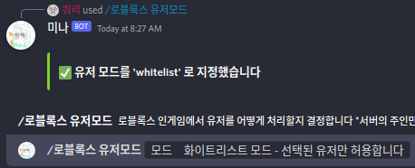
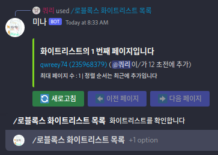

title: 화이트리스트 사용법

**이전글 [블랙리스트(밴) 사용법](/mina/rblxConnect/blacklist)** | **[표지로 가기](/mina/rblxConnect)**

# 화이트리스트(밴) 사용법

주의 : 화이트리스트 모드는 블랙리스트 모드와 호환되지 않습니다. 한번에 하나의 기능만 이용할 수 있습니다. 그러나 이 모드를 사용한다고 다른 모드의 목록이 사라지는것은 아닙니다. 다시 모드를 변경하면 원상복구 됩니다 
만약 서버 스크립트 설정과 API 키 설정을 하지 않았다면 [시작하기](/mina/rblxConnect/gettingstarted)를 읽어주세요 
 
화이트리스트 모드란 특정한 사람 빼고는 들어오는것을 허용하지 않는 모드를 말합니다. 따라서 게임에 들어올 수 있는 사람은 직접 입력해 주거나 스크립트 상에서 예외처리를 해주어야 합니다.

## 모드 변경
먼저 밴 기능을 사용하려면 유저 허용 모드를 '화이트리스트' 로 바꾸어야 합니다.
다음과 같이 `/로블록스 유저모드` 를 통해 유저모드를 바꿔주세요
*단 그 서버의 주인만 이용가능한 명령어입니다* 

다음과 같이 화이트리스트 모드로 유저 모드를 설정했다면 다음 단계로 넘어갈 수 있습니다

## 추가
서버의 주인 또는 [설정된 룰](/mina/rblxConnect/gettingstarted#_2)을 가진 사람은 화이트리스트에 사람을 추가할 수 있습니다.
`/로블록스 화이트리스트 추가` 를 이용해 특정 유저를 추가하세요

옵션으로써 유저의 이름(닉변 전 이름들도 가능) 혹은 유저 아이디를 입력하세요 (숫자식)

## 빼기
서버의 주인 또는 [설정된 룰](/mina/rblxConnect/gettingstarted#_2)을 가진 사람은 화이트리스트에 사람을 제거할 수 있습니다.
`/로블록스 화이트리스트 빼기` 를 이용해 특정 유저를 제거하세요

옵션으로써 유저의 이름(닉변 전 이름들도 가능) 혹은 유저 아이디를 입력하세요 (숫자식)

## 목록
서버의 주인 또는 [설정된 룰](/mina/rblxConnect/gettingstarted#_2)을 가진 사람은 화이트리스트 목록을 볼 수 있습니다. 이 목록은 버튼을 지원해 페이지를 쉽게 넘기며 확인해볼 수 있습니다. 정렬 순서는 최근 추가 순입니다
`/로블록스 화이트리스트 빼기` 를 이용해 특정 유저를 제거하세요 

옵션으로써 숫자를 주면 페이지를 특정할 수 있습니다. 옵션이 없으면 첫 페이지를 보여줍니다

**다음글 [모두허용 모드 사용법](/mina/rblxConnect/freepass)** | **[표지로 가기](/mina/rblxConnect)**
