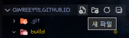
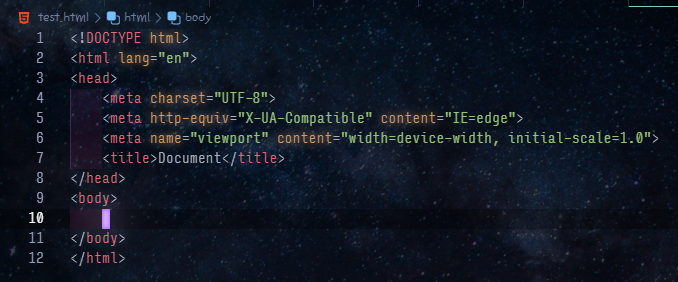
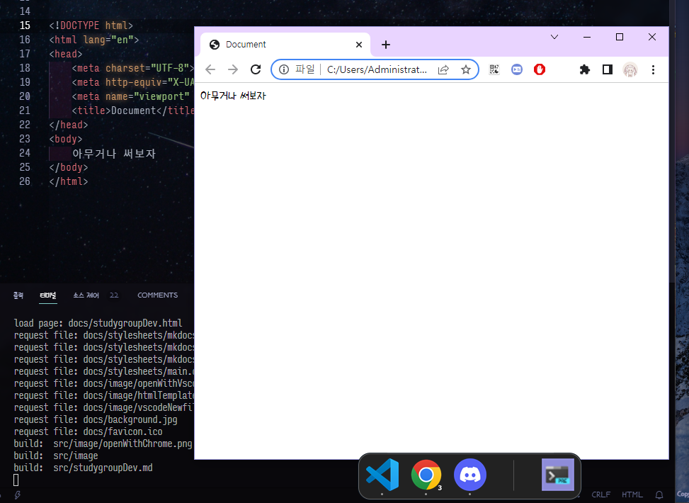

title: 진짜 개발시작?

# 이제 노가다

이전글은 [이거임](./studygroup2022)  

## 서론
electron 을 쓰겠다 했는데 이게 웹에 들어가는 html 이랑 css 그리고 js 를 이용해서 앱을 만들 수 있게 해줌.
<br><br>
우선 이 HTML, CSS, JS 가 뭐냐  

> -  HTML 은 `문서의 순서나, 불러올 파일들(사진,코드 등)`을 넣거나 글자를 넣는등의 `기본적 배치`를 하는데 쓰임  
> - css 는 스타일 시트라고 해서 글자의 크기, 색깔, 폰트, 더 나아가 애니메이션(예는 우리가 지금 필요없음), 즉 스타일적 부분을 넣어주는데 쓰임  
> - js(javascript) 는 글자를 바꾸거나, 내가 만든 샘플 프로그램 처럼 데이터를 가져오거나, 화면에 표시되는걸 바꿔주거나 하는데 쓰이는 프로그래밍 언어, 근데 예는 만들려고 하는거 마다 필요한게 달라서 사람마다 다 따로 설명해줄 예정  

그래서 대충 만드는데 필요한건 3가지 정도가 됨

## HTML
일단 HTML 은 아주 간단함. 그냥 태그들로 데이터를 묶어주는것임, 예시를 보여주자면
<br>
```html
<!--이건 코멘트, 실제로 안보임-->
<i>기울임 글자</i>
```
> **결과**  
> <i>기울임 글자</i>  

요렇게  넣어주면 됨, 보면 태그는 모두 `<>` 요거로 감싸져있고, 시작한 태그는 `/` 가 없고 끝 태그에는 `/` 가 있는걸 볼 수 있음, 이게 html 문법.

---

그리고 이 태그 안에는 더 상세한 정보를 담아줄 수도 있음, (예: 글자 크기)
```html
<!--p 는 글자 넣는 테그-->
<p style="font-size:24px">큰 글자</p>
```
*스포일러 하자면 여기 style 이게 나중에 스타일시트가 될 예정*  
> **결과**
> <p style="font-size:24px">큰 글자</p>  

---

이게 문법 끝! 다른 문법이 있다면 `</img>` 이렇게 여는태그/닫는태그 안에 다른 데이터를 안 넣어도 되는경우 `` 이렇게 줄여 쓴다는것 빼고는 없음
<br><br>
그럼 태그의 종류는 뭐뭐가 있냐가 중요한데, 상당히 많은 종류의 태그가 있기는 하지만 우리가 만들려 하는건 딱히 많은것을 필요로 하지는 않음  

샘플 프로그램의 경우 &lt;html&gt;,&lt;title&gt;,&lt;body&gt;,&lt;div&gt;,&lt;p&gt;,&lt;script&gt;,&lt;img&gt; 딱 요만큼 들어갔음
<br><br>
우선 코드 파일을 만들기 위해서 vscode 로 아무런 폴더를 열고(바탕화면에 폴더 하나 만들고 우클릭, vscode 로 열기)  
  

그런 다음 옆 탐색기 창에 새 파일 클릭  
  

파일 이름은 `index.html` 으로 하고 만들고 열어 보면 이제 html 코드를 만들 수 있음  
간단히 `!` 누른다음 탭키를 눌러주면 HTML 템플릿이 나오게 될 것임  
  

이제 여기서 맨 윗줄 DOCTYPE html 저건 그냥 이 문서가 html 문서이다 하고 알려주는 부분이고 모든 html 데이터는 html 태그 안에 담기게 될것임, head 안에 담긴것 같은 경우 사이트의 이름(탭 이름에 표시될 이름), 가져올 스타일시트 파일, 사이트 설정과 같은 배치와 무관한 애들이 들어가고 body 안에 담기는 애들이 실제 우리 눈에 보이게 될 것임
<br><br>
대충 body 안에 쓰고싶은 글을 쓰고 파일탐색기에서 우클릭-연결프로그램-크롬 해서 열어보면 쓴 내용이 나옴
  
  

이제 대충 구글에 html 이미지 넣기 이렇게만 처도 예시들이 널려있으니 태그에 관한거는 직접 살펴보길 바람  

## CSS
스타일 시트 같은 경우는 head 안에 넣는게 보편적임, 그리고 link 라는 태그를 이용해서 파일을 불러옴  
이제 `index.css` 라는 파일 하나 index.html 만들었던 똑같은 폴더 안에 만들어 주고 index.html 을 이렇게 작성
```html
<!DOCTYPE html>
<html lang="en">
<head>
    <meta charset="UTF-8">
    <meta http-equiv="X-UA-Compatible" content="IE=edge">
    <meta name="viewport" content="width=device-width, initial-scale=1.0">
    <title>title 여기에는 그냥 사이트 제목</title>
    <!--이렇게 스타일 시트를 넣음-->
    <link rel="stylesheet" href="index.css">
</head>
<body>
    <p class="text red">1 </p>
    <p class="text green">2 </p>
    <p class="text blue">3 </p>
    <p id="asdf">4</p>
</body>
</html>
```
이건 css 파일에  
```css
p { /* 이렇게 하면 p 태그 모두 적용 */
    /* 스타일명 : 값; */
    font-size: 24px; /* 이렇게 적용 할 것을 결정하고 {} 를 열어 그 안에 속성을 넣어주면 됨 */
    height: 26px;
}
.text { /* 이렇게 . 을 붇이면 class 에 text 가 들어가있는 애를 선택, 그래서 1 2 3 선택됨 */
    font-family: sans-serif;
}
body .text {
    /* 이렇게 하면 body 안에 있는 text 클래스를 가진 애를 선택, 똑같이 1 2 3 선택됨 */
}
.text.red {
    /* text 와 red 라는 클래스 동시에 가진 애만 선택, 1만 선택됨 */
    color: red;
}
#asdf {
    /*예 는 id 에 asdf 적힌 애 선택, 맨아래 4 만 선택됨*/
}
#asdf, .text {
    /* , 을 통해서 둘다 선택할 수도 있음 (or), 1234 선택됨 */
}
```
위에 처럼 css 문법은
```css
선택자 {
    스타일: 값;
}
```
형식으로 만들어짐, 여기서 선택자는 저 위에처럼 클래스 가진 애로 선택하는거랑 id 가진 애로 선택하는게 가능함, class 는 여러개를 가질 수 있지만 (`<p style="text title"></p>` 이런식으로 띄어쓰기로 구분) id 는 하나만 넣을 수 있음

문법은 이게 다고, :not 선택자 처럼 더 세부적인 선택자도 있는데 이건 필요하면 검색하면 됨  
<https://developer.mozilla.org/ko/docs/Web/CSS/padding> 이렇게 미리보기와 설명이 적힌 사이트 많으니까 스타일도 필요하면 찾아보는 식으로 대충 툴만 잡아보면 끝  


<del>솔찍히 필요한건 검색하면 다 나와서</del> 중간에 배치라던가 화면 절반으로 가르기나 이미지 넣기, 표 만드는 그런거도 다 검색하면 나와서 필요한거 검색 해 가며 만들 프로그램 틀만 만들고 꾸며 오면 코드 부분은 같이 짜는거로 하자  
